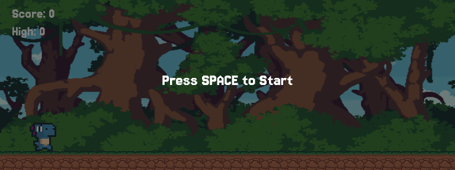

# Dino Game (JavaScript Clone)

A simple clone of the **Chrome Dono Game** built with **HTML5 Canvas** and **JavaScript**. This implementation includes desktop and mobile support, dynamic difficulty scaling, and responsive design.

Access the browser game here: [Dino Game](https://24hour-dino-game.vercel.app)

  

## Project Overview

This project recreates the classic Chrome offline dinosaur game with additional features and optimizations. The game was developed from scratch without using game engines, demonstrating core game development principles in JavaScript.

## Features

- **Cross-Platform Controls**
  - Press `Space` to jump & `Down Arrow` to duck.
  - `Tap` to jump & `Swipe Down` to duck.
- **Progressive Difficulty**
  - Speed increase over time (scales with score).
  - Obstacle variety expands as game progresses.
- **Performance Optimization**
  - Sprite animation with frame skipping.
  - Efficient collision detection.
  - Background parallax scrolling.
- **Responsive Design**
  - Dynamic canvas.
  - Mobile orientation detection.
  - Touch controls with swipe detection.
- **Game State Management**
  - Start screen, gameplay, and game over states.
  - Score tracking with high score persistance per session.

## Total Time Spent (Including sourcing and creation of assets)

**10 hours, 48 minutes, and 12.90 seconds**

# Technical Implementaion

### Core System

1. **Animation System**
   - Frame-based sprite animation with configurable delays.
   - Seperate animation tracks for idle, running, ducking states.
   - Smooth transition between those states.
2. **Physics System**
   - Custom gravity implementation with variable jumping arcs.
   - Collision detection with hitbox adjustments.
   - Dynamic ground and obstacle movement.
3. **Obstacle Generation**
   - Randomized obstacle timing ans seleciton.
   - Progressive difficulty with speed and obstacle variation.
   - Flying obstacles with different collision patterns.

### Challenges

1. **Mobile Adaptation**
   - Implementation of touch controls with swipe detection.
   - Landscape orientation.
2. **Animation**
   - Development of sprite animation and all aspects of custom objects.
   - Collision detection for odd shaped obstacles.
3. **Game Balance**
   - Tuning jump and gravity physics.

## Asset Credits

- [Dino Character Sprites](https://arks.digital/) - arks.digital
